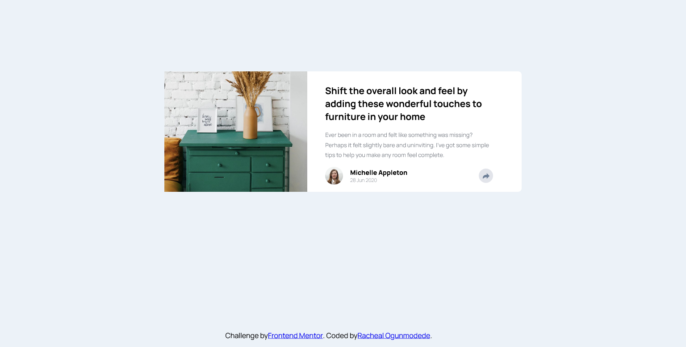
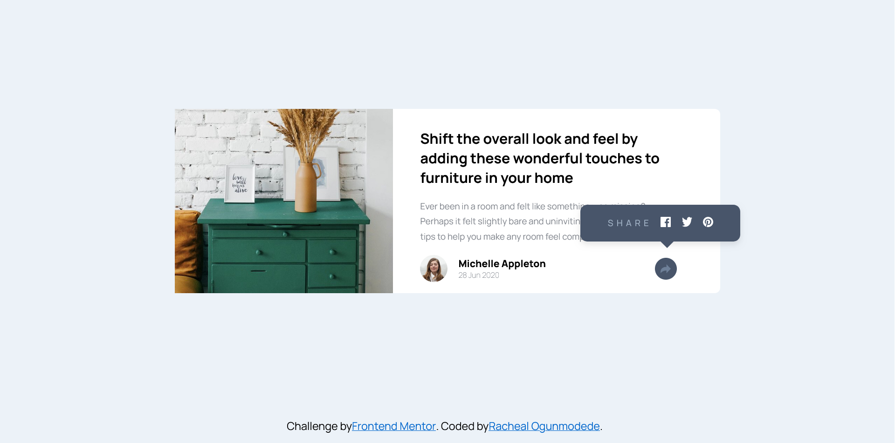
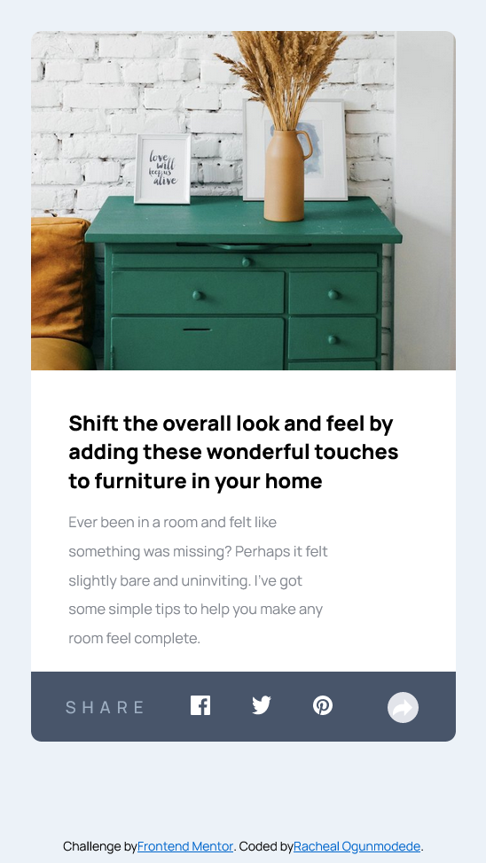

# Frontend Mentor - Article preview component solution

This is a solution to the [Article preview component challenge on Frontend Mentor](https://www.frontendmentor.io/challenges/article-preview-component-dYBN_pYFT). Frontend Mentor challenges help you improve your coding skills by building realistic projects. 

## Table of contents

- [Overview](#overview)
  - [The challenge](#the-challenge)
  - [Screenshot](#screenshot)
  - [Links](#links)
- [My process](#my-process)
  - [Built with](#built-with)
  - [What I learned](#what-i-learned)
  - [Continued development](#continued-development)
  - [Useful resources](#useful-resources)
- [Author](#author)
- [Acknowledgments](#acknowledgments)


## Overview

### The challenge

Users should be able to:

- View the optimal layout for the component depending on their device's screen size
- See the social media share links when they click the share icon


### Screenshot






### Links

- Solution URL: [Github](https://github.com/LaDonaAmor/article-preview-component-master)
- Live Site URL: [Live Link](https://frontend-mentor-article-preview-solut.netlify.app)


## **My process**

### Built with

- Semantic HTML5 markup
- Clean, maintainable CSS
- Flexbox for layout
- Mobile responsive design
- Vanilla JavaScript for interactivity
- BEM-inspired class naming
- CSS `::after` pseudo-element for the tooltip arrow
- Responsive media query at `767px` and `375px`


### What I learned

This challenge deepened my understanding of **responsive behavior** and **interactive UI patterns**. 
Key takeaways:

1. **Mobile-First Popup Integration**
```css
.profile.active {
    background-color: hsl(217, 19%, 35%);
    border-radius: 0 0 0.625rem 0.625rem;
}
```

Instead of hiding the profile on mobile, I transformed it into the share bar — a cleaner, more performant approach than absolute positioning.

2. **Z-Index & Layering for Share Button**
```css
.profile.active .share-btn {
    position: relative;
    z-index: 10;
}
```

Ensured the share button stays on top of the popup bar in mobile view.

3. **Smooth Toggle with JavaScript**
```javascript
profile.classList.toggle('active');
```

Used classList.toggle() with stopPropagation() to prevent unwanted closures.

4. **Pixel-Perfect Text Wrapping**
```css
h2 {
  max-width: 30ch;
  word-break: break-word;
}

.description > p {
  line-height: 1.4rem;
  max-width: 70ch;
  word-break: break-word;
}
```

Used ch units to control line breaks exactly like the design.


### Continued development

In future projects, I want to focus on:

- CSS Custom Properties for theming (light/dark mode)
- CSS Transitions for smoother popup animations
- Accessibility: ARIA labels, keyboard navigation, focus states
- Performance: Lazy loading images, reducing CLS


### Useful resources

- [MDN Web Docs](https://developer.mozilla.org/en-US/docs/Web/CSS/CSS_Flexible_Box_Layout) - Flexbox – The ultimate guide for layout control.
- [CSS-Tricks](https://css-tricks.com/snippets/css/a-guide-to-flexbox/) - A Complete Guide to Flexbox – Visual cheat sheet I keep bookmarked.
- [MDN: Element.classList → Official docs with examples](https://developer.mozilla.org/en-US/docs/Web/API/Element/classList)


## Author

- GitHub: [@LaDonaAmor](https://github.com/LaDonaAmor)
- Frontend Mentor: [@LaDonaAmor](https://www.frontendmentor.io/profile/LaDonaAmor)
- X: [@LaDona_Amor](https://x.com/LaDona_Amor))


## Acknowledgments

A huge **thank you** to the **[Frontend Mentor](https://www.frontendmentor.io/)** team for creating this challenge and giving developers like me the opportunity to grow through real-world projects. The clear designs, supportive community, and focus on practical skills make every challenge a valuable learning experience.

Proudly built with love, precision, and a lot of coffee.